# c302

<p align="center">
  
</p>

A research prototype exploring behavioral modulation of LLM coding agents using C. elegans connectome-derived neural dynamics.

## What is this?

c302 is a **behavioral modulator** for an LLM coding agent. A separate controller sits outside the LLM and adjusts a **behavioral control surface** — a packet of parameters that constrain and steer the LLM's behavior on each iteration. The controller substrate varies across experimental phases, from a static baseline to a live neural simulation driven by the OpenWorm/c302 connectome model.

## Project Structure

```
c302/
├── packages/agent/        # TypeScript agent package (interfaces, research logger)
├── packages/presentation/ # Reveal.js presentation (stub)
├── worm-bridge/           # Python FastAPI controller server
├── demo-repo/             # Express todo app the agent works on
├── scripts/               # Experiment and utility scripts
└── research/              # Research documents and experiment data
```

## Quick Start

```bash
# Install dependencies
make install

# Run Python tests
cd worm-bridge && python3.11 -m pytest -v

# Run TypeScript tests
npm test

# Run demo app tests (14 pass, 4 search tests fail by design)
cd demo-repo && npm test

# Start the worm-bridge controller
cd worm-bridge && python3.11 -m uvicorn worm_bridge.server:app --port 8642
```

## Experimental Phases

| Phase | Controller | Description |
|-------|-----------|-------------|
| 0 | — | Project scaffolding |
| 1 | Static baseline | Fixed mode cycle, no modulation |
| 2 | Synthetic | Hand-tuned state machine with reward-modulated updates |
| 3A | Replay connectome | Precomputed c302 neural traces mapped to state variables |
| 3B | Live connectome | Live NEURON simulation with reward-as-stimulus |
| 4 | Plasticity | Engineered Hebbian-style synaptic adaptation (optional) |
| 5 | Analysis | Cross-phase comparison and presentation |

## License

MIT
