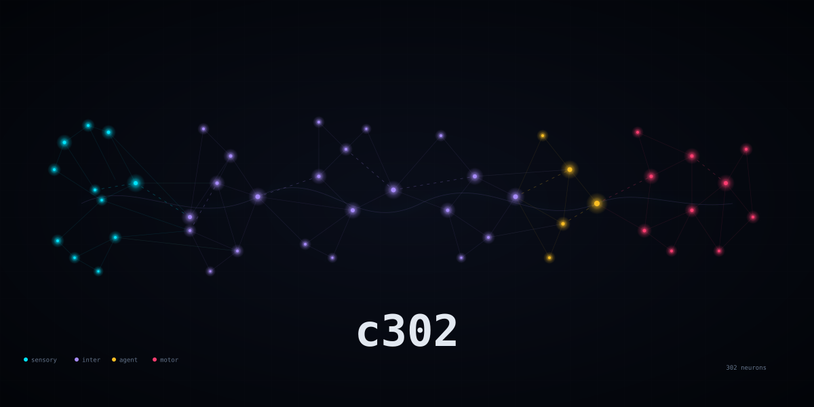

# c302

<p align="center">
  
</p>

A research prototype that uses a live 14-neuron simulation of the *C. elegans* connectome to modulate the behavior of an LLM coding agent. A controller — running real biological neural dynamics — sits outside the LLM and shapes its decisions on every iteration through a seven-parameter control surface.

## Background

- **Read the paper** — [research/PAPER.md](research/PAPER.md). The full write-up: architecture, six controller substrates, 392 experiment runs.
- **See the slides** — [c302-presentation-production.up.railway.app](https://c302-presentation-production.up.railway.app/).
- **Central finding** — a live NEURON simulation receiving closed-loop feedback from the agent achieves a 0.960 test pass rate at Level 2, while the **same** neurons and synapses in trace-replay (no feedback) get 0.867 and never produce code that changes test outcomes. The worm's wiring works — but only when it's alive.

## How the pieces fit

Three components, each in its own directory:

| Component | Directory | What it does |
|-----------|-----------|--------------|
| **LLM coding agent** | [`packages/agent/`](packages/agent/) | TypeScript loop wrapping Claude Sonnet 4. Five tools, six iterations per tick, observes the demo repo. |
| **Controller** | [`worm-bridge/`](worm-bridge/) | Python FastAPI server. Seven controller substrates: `static`, `random`, `synthetic`, `replay`, `connectome`, `live`, `null`. Emits a 7-parameter control surface each tick. |
| **Task domain** | [`demo-repo/`](demo-repo/) | TypeScript todo app with intentionally-failing tests. The agent's job is to make them pass. |

Supporting directories: [`research/`](research/) (paper, methodology, experiment outputs), [`scripts/`](scripts/) (experiment runners).

## Reading order

If you're using Claude or Cursor to explore this repo, start here:

1. [`research/PAPER.md`](research/PAPER.md) — the whole story end to end.
2. [`worm-bridge/worm_bridge/controllers/`](worm-bridge/worm_bridge/controllers/) — the seven controller substrates. Read in evolution order: `static.py` → `random_controller.py` → `synthetic.py` → `replay.py` → `connectome.py` → `live.py` → `null.py`.
3. [`packages/agent/src/index.ts`](packages/agent/src/index.ts) — the main tick loop.
4. [`packages/agent/src/types.ts`](packages/agent/src/types.ts) — `ControlSurface`, `TickRequest`, `TickResponse`. The contract between agent and controller.
5. [`worm-bridge/worm_bridge/server.py`](worm-bridge/worm_bridge/server.py) — the HTTP boundary.

## Quick start

```bash
make install

# Run agent + bridge test suites (all should pass)
npm test
cd worm-bridge && pytest

# Demo-app tests (19 pass, 6 priority tests fail by design — that's the agent's job)
cd demo-repo && npm test

# Start the controller server
make worm-bridge-dev
```

## Experimental phases

| Phase | Controller | Status | Description |
|-------|-----------|--------|-------------|
| 0 | — | done | Project scaffolding |
| 1 | Static baseline | done | Fixed mode cycle, no modulation |
| 2 | Synthetic / replay / live | done | Hand-tuned state machine, c302 trace replay, live NEURON simulation |
| 3 | Null + un-preloaded context | in progress | Uncontrolled baseline + conditions that exercise the full control surface |
| 4 | Plasticity | future | Engineered Hebbian-style synaptic adaptation |
| 5 | Analysis | future | Cross-phase comparison |

## License

MIT
